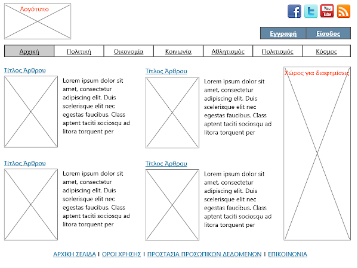
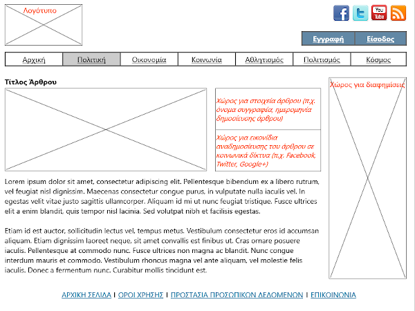
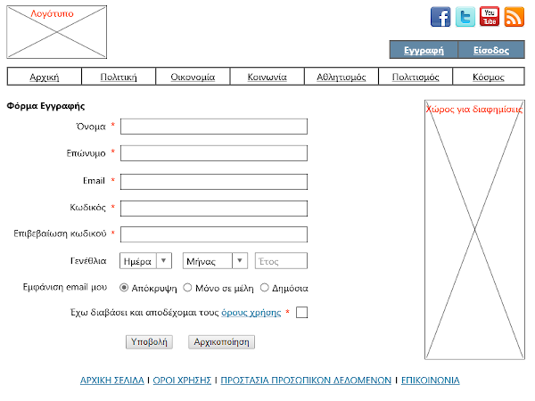

# PLH23

## Telematics, Internet and Society

Webpages for projects submitted in module PLH23, Computer Science course (Hellenic Open University)

* ### GE2

Part of this assigment requires designing & publishing a webpage for a fictional newspaper. Basic layout should conform to the following screenshots:

> * Index Page
>
>
>
> * Article Details
>
> 
>
> * Signup Form
>
>
